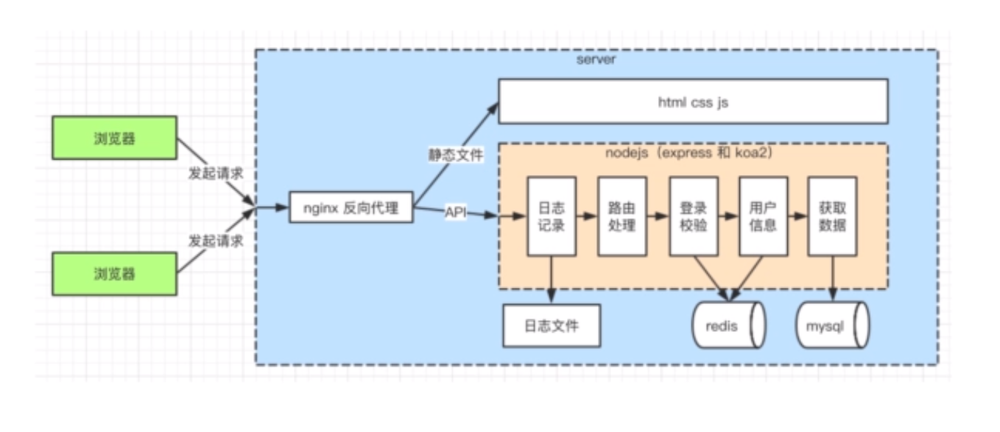

# 10-1 开始
## 使用koa2
- express中间件是异步回调，koa2原生支持async/awit
- 新开发的框架和系统，都开始基于koa2,例如ess.js
 - express虽然为过时，但是koaw肯定是未来趋势

## 目录
- 介绍async/await
    1. await 后面可以追加 promise 对象，获取resolve 的值
    2. await 必须包裹在 async 函数里面
    3. async 函数执行返回的也是一个promise
    4. try-catch 截获Promise 中的reject 的值

# 10-2 介绍koa2
- 安装（使用脚手架）
    - npm install -g koa-generator
    - Koa2 koa2--test
    - npm install & npm run dev
- 初始化代码，处理路由
- 使用中间件

# 10-5 实现session
- 和express 类似
- 基于koa-generic-session 和 koa-redis
   ```
       cnpm i koa-generic-session koa-redis redis --save
   ```
# 10-6 开发路由
## 路由
- 复用之前代码，如mysql,登录中间件，controller,model
- 初始化路由，前端联调
```
cnpm i mysql xss --save
```


# 11-3 进程守护 pm2
- node app.js 和 nodemon app.js 进程崩溃则不能访问
- pm2 遇到进程崩溃，会自动重启

# 11-4 常用配置 pm2
- 新建pm2 配置文件（包括进程数量，日志文件目录等）
- 修改pm2 启动命令，重启
- 访问server, 检查日志文件的内容（日志记录是否生效）
# 11-5 多进程
- 为什么使用多进程
    - 操作系统会限制一个进程的最大可用内存
    - 内存：无法充分利用机器的全部内存
    - CPU:无法充分利用多核CPU的优势
- 多进程redis
    - 多进程之间，内存无法共享
    - 多进程访问一个redis,实现数据共享
# 11-6 上线与配置总结
- 服务器运维，一般由专业的OP人员和部门来处理
- 大公司都有自己的运维团队
- 中小型工期推荐使用一些云服务，如华为云的node平台

- pm2的核心价值 进程守护
- pm2的常用命令和配置，日志记录
- 多进程


# 学会node.js,晋升全栈工程师


